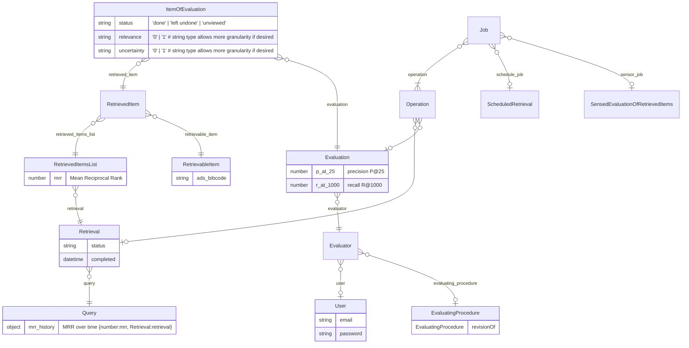

```mermaid
erDiagram
    Retrieval }o--|| Query : query
    Query {
        object mrr_history "MRR over time {number:mrr, Retrieval:retrieval}"
    }
    RetrievedItemsList }o--|| Retrieval: retrieval
    Retrieval {
        string status
        datetime completed
    }
    RetrievedItemsList {
        number mrr "Mean Reciprocal Rank"
    }
    RetrievedItem  }o--|| RetrievedItemsList : retrieved_items_list
    RetrievedItem }o--|| RetrievableItem : retrievable_item
    RetrievableItem {
        string ads_bibcode
    }
    ItemOfEvaluation }o--|| RetrievedItem : retrieved_item
    ItemOfEvaluation }o--|| Evaluation : evaluation
    Evaluation {
        number p_at_25 "precision P@25"
        number r_at_1000 "recall R@1000"
    }
    ItemOfEvaluation {
        string status "'done' | 'left undone' | 'unviewed'"
        string relevance "'0' | '1' # string type allows more granularity if desired"
        string uncertainty "'0' | '1'  # string type allows more granularity if desired"
    }
    Evaluation }o--|| Evaluator : evaluator
    Evaluator }o--o| User : user
    User {
        string email
        string password
    }
    Evaluator }o--o| EvaluatingProcedure: evaluating_procedure
    EvaluatingProcedure {
        EvaluatingProcedure revisionOf
    }
    Job }o--|{ Operation : operation
    Job }o--o| ScheduledRetrieval : schedule_job
    Job }o--o| SensedEvaluationOfRetrievedItems: sensor_job
    Operation }o--o| Retrieval : ""
    Operation }o--o| Evaluation : ""
``` 
