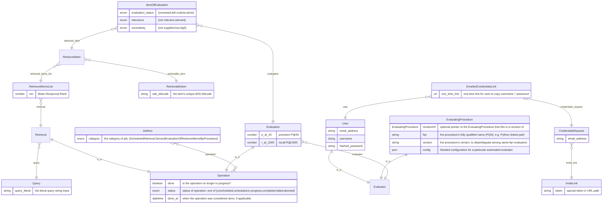

```mermaid
erDiagram
    Query {
        string query_literal "the literal query string input"
    }

    Operation {
        boolean done "is the operation no longer in progress?"
        enum status "status of operation: one of {unscheduled,scheduled,in progress,completed,failed,aborted}"
        datetime done_at "when the operation was considered done, if applicable"
    }

    Retrieval }o--|| Query : query
    Retrieval ||--|| Operation : is_a
    
    RetrievedItemsList {
        number mrr "Mean Reciprocal Rank"
    }
    RetrievedItemsList }o--|| Retrieval: retrieval

    RetrievedItem  }o--|| RetrievedItemsList : retrieved_items_list
    RetrievedItem }o--|| RetrievableItem : retrievable_item

    RetrievableItem {
        string ads_bibcode "the item's unique ADS bibcode"
    }

    ItemOfEvaluation {
        enum evaluation_status "{unviewed,left undone,done}"
        enum relevance "{not relevant,relevant}"
        enum uncertainty "{not supplied,low,high}"
    }
    ItemOfEvaluation }o--|| RetrievedItem : retrieved_item
    ItemOfEvaluation }o--|| Evaluation : evaluation
    
    User {
        string email_address
        string username
        string hashed_password
    }
    User ||--|| Evaluator : is_a

    InviteLink {
        string token "special token in URL path"
    }

    CredentialsRequest {
        string email_address
    }
    CredentialsRequest }o--|| InviteLink : invite_link

    EmailedCredentialsLink {
        url one_time_link "one-time link for user to copy username + password"
    }
    EmailedCredentialsLink }o--|| User : user
    EmailedCredentialsLink |o--|| CredentialsRequest : credentials_request
    
    EvaluatingProcedure {
        EvaluatingProcedure revisionOf "optional pointer to the EvauatingProcedure that this is a revision of"
        string fqn "the procedure's fully qualified name (FQN), e.g. Python dotted path"
        string version "the procedure's version, to disambiguate among same-fqn evaluators"
        json config "Needed configuration for a particular automated evaluator"
    }
    EvaluatingProcedure ||--|| Evaluator : is_a

    Evaluation {
        number p_at_25 "precision P@25"
        number r_at_1000 "recall R@1000"
    }
    Evaluation }o--|| Evaluator : evaluator
    Evaluation ||--|| Operation : is_a 

    JobRun {
        enum category "the category of job: {ScheduledRetrieval,SensedEvaluationOfRetrievedItemsByProcedure}"
    }
    JobRun }o--o{ Operation : operation
``` 
